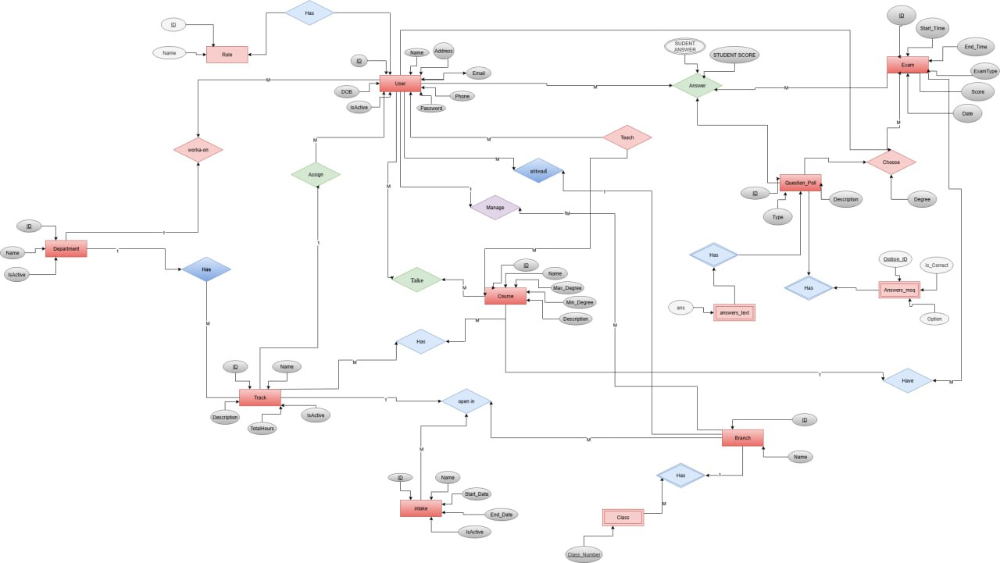
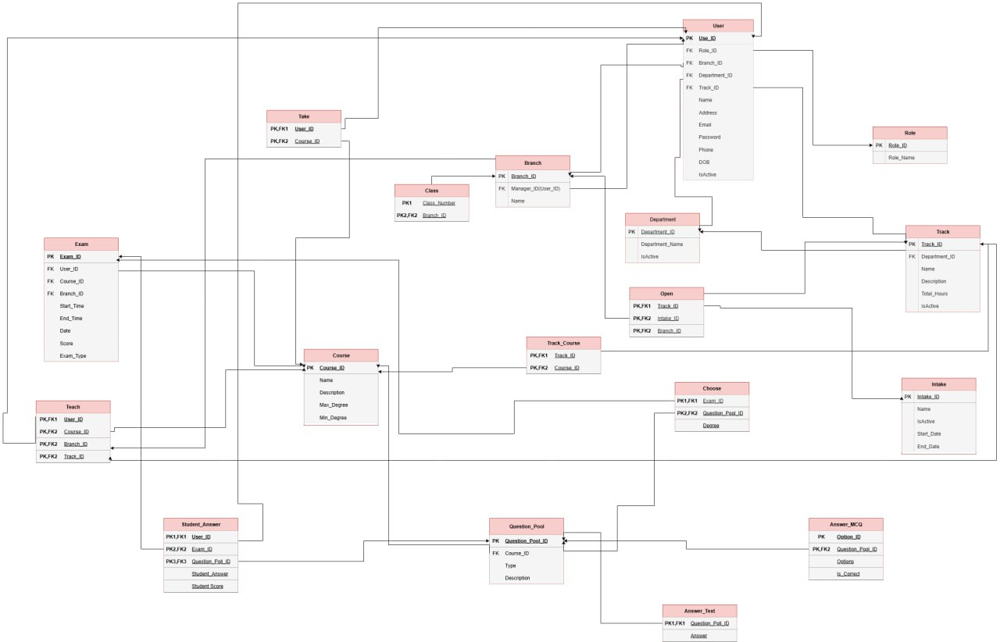

# Examination System Database

---

## 📌 Project Overview
The **Examination System Database** is a SQL Server project that manages the full exam lifecycle:

- Creating exams
- Assigning questions
- Submitting student answers
- Automatic grading
- Calculating and reporting results

This project demonstrates advanced SQL Server programming using **Stored Procedures, Triggers, Constraints, and Views** to ensure data integrity and automation.

---

## ⚙️ Exam Process Flow

### Question Bank
- Instructors create and manage a pool of questions (MCQ, True/False, Text).
- Each question is linked to a course and has a degree (mark).

### Exam Creation
- Exams are linked to courses, tracks, branches, and intakes.
- Questions can be assigned manually or randomly.

### Student Participation
- Students are assigned exams through the system.
- Answers are recorded in `Exam_Student_Questions_Answers`.

### Automatic Grading
- Objective questions (MCQ, True/False) are graded automatically.
- Marks are stored per question.

### Result Calculation
- `Calculate_Result` procedure sums correct answers and returns the student’s final score per exam.
- `CourseResult` procedure gives instructors an overview of student performance in their course.

---

## 📊 Example Stored Procedures

- `Register_Student` – Add new students.
- `Register_Instructor` – Add new instructors.
- `Register_Course` – Add new courses.
- `Calculate_Result` – Calculate final score for a student in a specific exam.
- `CourseResult` – Show student scores for a course taught by an instructor.

---

## 🛠️ Technologies

- **Database:** Microsoft SQL Server 2022
- **Language:** SQL (DDL, DML, Stored Procedures, Triggers, Views)
- **Backup & Restore:** `.bak` file for database recovery
- **Diagrams:** ERD & Mapping

---

## 📂 Repository Structure

- Examination-System-Database/
- ├── Data/ # Inserted Data
- ├── Queries/ # SQL scripts (DDL, DML, Stored Procedures, Views, Triggers)
- ├── ERD-Mapping/ # ERD diagrams and mapping documents
- ├── Database/ # Database backup file (.bak)
- ├── Documentation/ # Project report (PDF)
- └── README.md # Project description

---

## 📷 Project Screenshots

### ERD Diagram

### Sample Interface / Query Results

> ⚠️ Replace the image paths with the actual file paths in your repository.

---

## ▶️ How to Use

1. Restore the database from the provided `.bak` file in SQL Server.
2. Run SQL scripts in `Queries/` to create and test procedures, views, and triggers.
3. Use `Calculate_Result` and `CourseResult` to analyze exam outcomes.
4. Refer to `Documentation/Examination System Documentation.pdf` for full project details.

---

## 👥 Team Members

- Karim Nour Mohamed  
- Ahmed Salama AlWelaily  
- Abdelrahman Yakout  
- Mohamed Kotb ElSheikh  
- Youssef ElSayed Radwan  

**Supervised By:** Eng. Sarah Salah

---

## 📅 Date

August 2025
